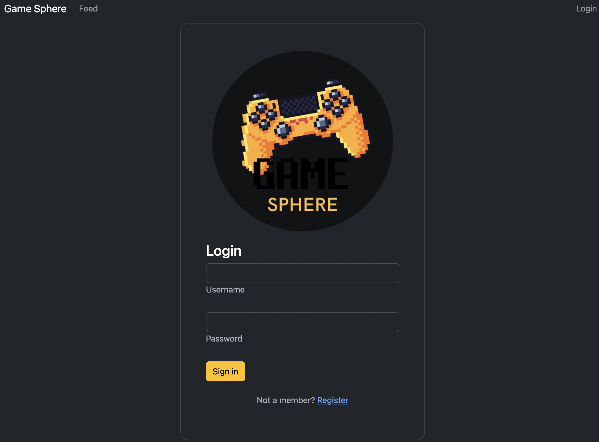
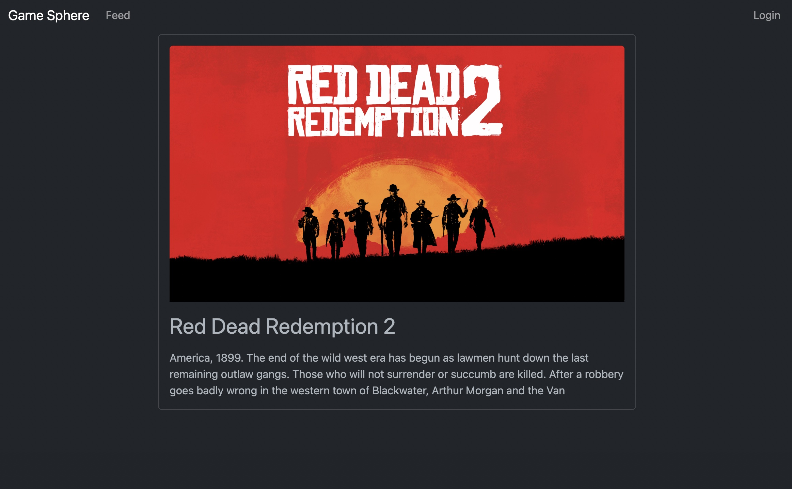

# 02-Project-Gamesphere-A-Gaming-Social-Web-Application

This project was created to demonstrate an important milestone in our full-stack bootcamp: Designing and building our first full-stack web application. We have designed and built an app using the MVC paradigm, created our own server-side API, added user authentiction and connected to a database.

## Description

Welcome to GameSphere, a simple application that allows users to post, follow users, and view their feed. This project was created as a demonstration of the basic social media functionality, and as such includes features like authentication, message creation, display, and user likes and comments. 

Welcome to GameSphere, a one-stop destination for gamers and enthusiasts alike! We provide a collection of games and topics for you to explore and engage with. Whether you're a hardcore gamer or simply looking to learn more about the latest trends in the gaming industry, our platform offers something for everyone.
With our user-friendly interface, you can easily navigate through the various categories, from action-packed games to strategy titles and everything in between. Additionally, you can leave comments on any game or topic that piques your interest, allowing you to engage in lively discussions and connect with like-minded individuals.

Heroku page: https://floating-thicket-35501.herokuapp.com/

## Credits
Technologies:  
Node js  
Express  
MySQL  
S3  
Other Technologies  
Sequelize  
Handlebars  
AWS SDK  
Multer  
Webpack  
Heroku  
Bootstrap 

## Developers

Meyer, Ian https://github.com/ianm1837 
Nunez Zepeda, Steven  https://github.com/SteveeZee03  
Pineda, Sharmaine https://github.com/tropical9   
Ramirez Solis Nguyen, Julieta https://github.com/justjulieta  
Ridder, Chris https://github.com/cridder

## License
 
